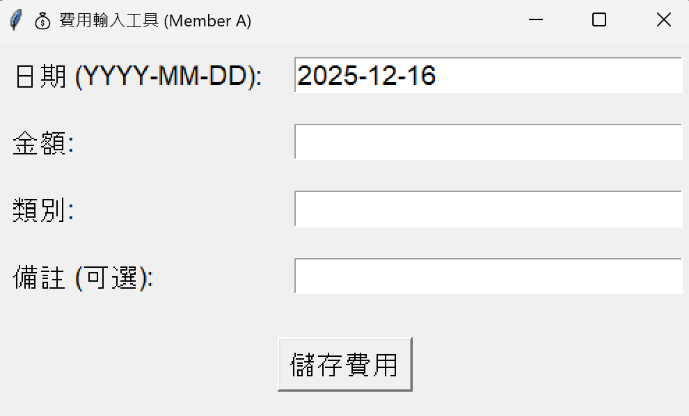
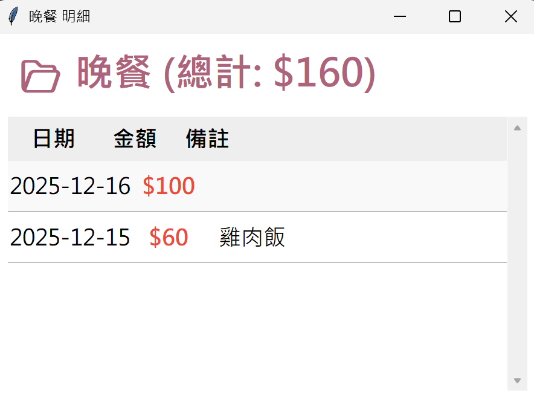

# SE-HW2 簡單記帳-個人支出圓餅圖
這是一個由 Python 開發的記帳應用程式，採用 **雙模組並行架構**。
系統分為「資料輸入」與「視覺化分析」兩個獨立執行的模組，透過 `expenses.csv` 進行即時資料連動。
## 專案特色 (Key Features)

### 1. 記帳輸入模組 (Input Module)
* **GUI 介面**：清晰易讀的 Tkinter 輸入視窗。
* **資料驗證機制**：
    * 自動檢查日期格式是否正確。
    * 防止輸入負數或非數字金額。
    * 確保類別欄位不為空。
* **資料儲存**：自動建立或更新 `expenses.csv`，支援 UTF-8 編碼，防止亂碼。

### 2. 視覺化模組 (Visualization Module)
* **即時連動更新**：程式會自動偵測 CSV 檔案變化，輸入新資料後圖表會**自動刷新**，無需重啟。
* **互動式圓餅圖**：
    * **懸停特效**：滑鼠移過區塊時，透明度與字體大小會產生變化，會突出特定類別。
    * **點擊查看明細**：點擊圓餅圖區塊，會彈出該類別的詳細視窗。
* **智慧明細視窗**：
    * **自動換行 (Smart Wrap)**：備註欄位會根據視窗寬度**自動調整換行**，確保文字完整顯示。
    * **響應式滾動**：支援滑鼠滾輪瀏覽長列表。

---

## 安裝與執行說明 (Execution)

### 1. 環境設定
本專案依賴 `pandas` 與 `matplotlib` 套件，請先開啟終端機 (Terminal/CMD) 安裝：

```bash
pip install pandas matplotlib
```
### 2. 環境設定
* 步驟一：啟動記帳輸入視窗

```bash
python Input_module.py
```


可以輸入日期 金額 類別 備註（可選）

* 步驟二：啟動視覺化圖表
```bash
python Visualization_module.py
```

滑鼠移動可以凸顯特定類別
* 步驟三：按下類別，打開明細表格

## 開發成員
（為了方便看分工沒有刪除不要的branch）
* Member A-邱采嫻: 負責 Input Module 。
* Member B-歐家怡: 負責 Visualization Module。


## Demo 連結
https://youtu.be/1EjJahSy_FA?si=blST08ix1zkokzVD
